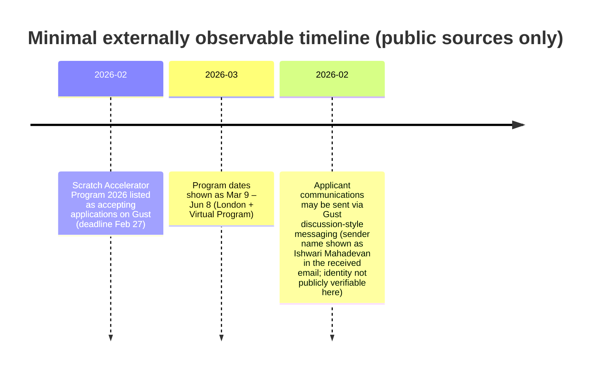

# Ishwari Mahadevan and Gust Messaging Verification Report

## Executive summary

Public information does **not** reliably identify a specific, verifiable individual named **Ishwari Mahadevan** connected to the accelerator email you received, beyond the name shown in the message signature. Across primary/official sources surfaced in this research pass, there is **no confirmed LinkedIn / X / GitHub / personal site / bio page** that can be confidently attributed to the same person acting in the “Scratch Accelerator Program 2026” application process. Accordingly, **education, career timeline, prior VC/accelerator experience, public statements, and portfolio ties are unspecified** based on public sources reviewed. citeturn8search0turn25search0

What *is* strongly supported by public sources is that your message aligns with how **Gust** communications can work for programs run on its accelerator tooling: program operators can create applications, build screening pipelines, add evaluators/admins, and communicate with applicants through platform-mediated threads. citeturn27view0turn24search8

The “Scratch Accelerator Program 2026” listing on Gust is publicly visible, with an application deadline of **Feb 27** and program dates **Mar 9 – Jun 8** (London + virtual). The listing’s text is broad and generic, and the underlying URL/application labeling shows internal naming inconsistencies (not uncommon on platforms, but still a due-diligence flag when combined with limited external footprint). citeturn4view0turn9view0turn26search3

Email-domain legitimacy is **partially supportable**: (a) the domain is a subdomain of Gust’s primary domain (gust.com), and Gust publicly operates platform email/collaboration services; (b) there is at least one observed example of Gust-related notification traffic using `@messaging.gust.com` in the wild. However, **public official documentation explicitly confirming `messaging.gust.com` as Gust’s sending domain was not found** in the sources reviewed here, so verification should rely on *message-origin checks* (headers, in-platform message presence, and consistent gust.com links), not the From: address alone. citeturn24search10turn24search0turn24search1

## What is known from public sources about entity["company","Gust","startup platform"] and entity["organization","Scratch Accelerator Program","accelerator program on gust"]

A public Gust program page exists for **“Scratch Accelerator Program 2026”**. The page states the program runs **Mar 9 – Jun 8**, is associated with **entity["city","London","uk"]**, and is a “Virtual Program,” with an **Apply by Feb 27** deadline. The publicly visible “About this Program” description is generalized (training, hiring assistance, investor connections, mentorship). citeturn4view0turn5view0

The public “Entrepreneur Application” flow for this program is hosted on gust.com and routes applicants through a standard Gust onboarding/application funnel (name, startup stage, incorporation status, location, email/password creation). citeturn9view0turn26search3

Gust positions its “Gust for Accelerators” tooling as a way to manage accelerator applications and evaluation workflows (including customizable applications, screening processes, criteria, and evaluators). citeturn24search3turn27view0

## Ishwari Mahadevan identity and affiliation findings

### Current roles and affiliations

No primary/official page (Gust staff directory, “Scratch Accelerator Program” team page, press release, or identifiable LinkedIn profile) was found that credibly confirms who **Ishwari Mahadevan** is in relation to the program or to Gust as an employer/contractor. The name appears in the email you received, but the publicly accessible Gust program/accelerator pages reviewed do **not** display a corresponding contact person or staff listing. citeturn4view0turn5view0

Because Gust’s Terms of Service describe that Gust does **not review or verify user content** and cannot guarantee accuracy/completeness of user-provided content, a name appearing in program communications may be (a) a real program operator using Gust or (b) an alias/representation chosen by whoever controls the program account; public sources in this pass cannot adjudicate which. citeturn24search10

### Professional background, education, and public profiles

Search results for the exact name **“Ishwari Mahadevan”** did not surface a clearly matching professional profile (LinkedIn/X/GitHub/personal site) attributable to the accelerator screening context. Results largely returned **different spellings and different individuals** with similar surnames (e.g., “Aishwarya/Aiswarya/Ishwarya Mahadevan”), without evidence connecting them to the Gust accelerator message you received. citeturn8search0turn8search3turn8search9turn25search2

Accordingly, the following items are **unspecified from public sources reviewed**:

- Verified career timeline
- Verified education history
- Verified prior accelerator/VC employment
- Verified portfolio company connections
- Verified public statements/interviews/articles attributable to the same person

### Simple timeline of what can be supported

## Likely responsibilities in accelerator screening on Gust

Gust’s accelerator documentation describes how a program account typically operates:

- Program operators create an application and set a deadline; applications expire at **11:59pm** on the deadline date unless extended/closed manually. citeturn27view0  
- Operators configure an evaluation pipeline with stages such as **Applied, Screening, Interviews, Selected**, each with its own criteria. citeturn27view0  
- Operators add evaluators by entering their name/email; evaluators can be limited to specific pipeline stages. Admins have unrestricted access to edit the application/pipeline and manage evaluators/program publishing. citeturn27view0  

Separately, Gust’s communication documentation explains that **“Discussions are reply-all communications”** and that replies go **through Gust** (captured and sent to participants). citeturn24search8

Putting these together, the most plausible interpretation of your email (without asserting identity) is:

- The message you received is consistent with a **program-runner workflow** on Gust: applicants move into a “screening/shortlist” stage and receive instructions/questions via a Gust-managed thread. citeturn27view0turn24search8  
- “Ishwari Mahadevan” is likely the **display name** of the user (admin/evaluator) who initiated the message thread (or whose identity is attached to that thread), rather than necessarily the raw mailbox owner behind the sending infrastructure. Public sources available here do not confirm whether this person is affiliated with Gust, the program entity, or a third party. citeturn27view0turn24search10  

## Contact verification of `accelerator_program_application_discussion@messaging.gust.com`

### What can be validated from public sources

Gust is publicly reachable at its corporate headquarters and uses `info@gust.com` as a published contact email; this supports that `gust.com` is an official domain for the company. citeturn24search1

Gust’s Terms of Service explicitly describes Gust as the owner of the “Gust Platform” and enumerates that the platform includes services such as **“storage” and “email”** among other collaboration services, indicating Gust runs email-related functionality as part of the platform. citeturn24search10

There is at least one publicly viewable mailbox log page showing an inbound message from `share_request@messaging.gust.com`, suggesting `@messaging.gust.com` has been used as a sending identity for Gust-related notifications in practice (note: this is a third-party artifact, not Gust documentation). citeturn24search0

### What could not be confirmed within this research pass

No Gust primary/support page reviewed explicitly states “Gust sends platform messages from `messaging.gust.com`” or provides an allowlist of official sending domains. Therefore, **domain legitimacy should not be inferred solely from the visible From: address**. citeturn7search1turn24search8

### Practical verification checks to reduce spoofing/phishing risk

Even when a message appears to come from a “known” domain, security guidance commonly emphasizes that sender names/addresses can be deceptive and that recipients should validate authenticity via trusted channels and email-header authentication signals. citeturn0search18

For an accelerator screening email of this type, the highest-signal checks are:

- Confirm the same message thread exists **inside your Gust account** (matching content and timestamp) and that it is associated with your actual application entry. (This aligns with Gust’s description of discussion-style communications flowing through the platform.) citeturn24search8turn27view0  
- Inspect email headers for **SPF/DKIM/DMARC pass** and alignment to gust.com infrastructure (a common best practice for validating sending legitimacy). citeturn0search18  
- Treat any request to move “off-platform” quickly (external forms, file downloads, urgent payment requests) as higher risk unless clearly linked from `gust.com` pages and consistent with the program listing. Gust itself warns about platform-impersonation patterns and emphasizes expected in-platform initiation behaviors in some contexts. citeturn0search4  

## Reputation, credibility signals, and red flags

### Credibility signals

The program is listed on Gust’s public program directory/search and has a functioning Gust-hosted application flow, indicating it was created through Gust’s accelerator tooling rather than an obvious off-platform spoof. citeturn3view0turn4view0turn9view0

Gust provides documented mechanisms used by accelerator operators (pipelines, evaluators, staged screening), which is consistent with the “shortlisted + next steps” format of the email you received. citeturn27view0turn24search8

### Potential red flags / diligence gaps

These items do **not** prove wrongdoing, but they are signals that additional diligence is warranted:

The public accelerator page for “Scratch Accelerator Program” does not show an external website link, partner names, team bios, or other typical credibility indicators often present on established accelerator listings, whereas many other Gust program pages do include clear organizational attribution and external URLs. citeturn5view0turn24search4

There are inconsistent labels/URLs: the program is presented as “2026” publicly, but the underlying Gust program slug and application labeling show “2024” in places. This may be benign (reused setup/slug), but it also correlates with low-detail listings and should raise diligence standards before sharing sensitive information. citeturn4view0turn9view0turn26search3

Gust’s Terms explicitly state that Gust does not review or verify user content and cannot guarantee its accuracy/completeness. This is important context: a listing being present on Gust is not equivalent to the listing being vetted as “legitimate” by Gust. citeturn24search10

## Outreach language and technical screening questions

### Suggested reply language variants

**Formal (program operations tone)**  
Subject: Scratch Accelerator Program 2026 — Uniqueness + Technical Screening Contact  
Hello Ishwari,  
Thank you for the update—excited to hear we’ve been shortlisted for the Scratch Accelerator Program 2026.  
**Uniqueness:** P3 Lending is building a compliance-first, API-driven lending platform that combines transparent underwriting workflows, borrower-controlled data sharing, and fast partner integrations. Our differentiators are (1) automated investor/partner reporting, (2) programmable risk and repayment logic, and (3) a modular architecture designed for regulated fintech expansion.  
**Primary contact email for technical screening instructions:** [your best email].  
Thank you,  
Matthew Hagen, Founder

**Concise (copy/paste friendly)**  
Subject: Shortlisted — Uniqueness + Technical Contact  
Hi Ishwari — thank you.  
**Unique features:** compliance-first lending workflows, automated underwriting + reporting, borrower-controlled data sharing, and partner-ready APIs designed for rapid integration.  
**Technical screening contact email:** [your best email].  
Best,  
Matthew

**Technical (engineering + security emphasis)**  
Subject: Technical Screening Contact + Key Differentiators  
Hi Ishwari,  
Appreciate the shortlist.  
**Unique features:** API-first lending stack (auditable decisioning + event-sourced ledger), permissioned data-sharing model, automated compliance artifacts, and modular integrations (KYC/KYB, payment rails, servicing). We optimize for reproducibility, monitoring, and security-by-design.  
**Send technical screening instructions to:** [your best email].  
Regards,  
Matthew Hagen

### Three screening questions to ask during the technical screening

- What evaluation criteria will be used in the screening round (product readiness, security/compliance posture, traction, or team execution), and how are those weighted across pipeline stages? citeturn27view0  
- What technical artifacts do you expect to review (architecture diagram, API docs, security controls, data model), and is there a preferred format or secure upload method within Gust? citeturn27view0turn24search8  
- What are the program’s concrete expectations for pilots during Mar 9 – Jun 8 (e.g., target KPI milestones, integration partners, demo day requirements), and what support resources are guaranteed vs. “best effort”? citeturn4view0turn27view0  

## Sources and key facts table

| Topic | Source | URL | Key facts supported |
|---|---|---|---|
| Program listing | Gust program page: Scratch Accelerator Program 2026 | `https://gust.com/programs/scratch-accelerator-program-2024` | Public listing shows dates (Mar 9–Jun 8), location (London + virtual), and deadline (Apply by Feb 27). citeturn4view0 |
| Accelerator profile | Gust accelerator profile: Scratch Accelerator Program | `https://gust.com/accelerators/scratch-accelerator-program` | Public accelerator “About” text is generic; no visible team/contact details on the public page. citeturn5view0 |
| Application flow | Gust-hosted entrepreneur application flow | `https://gust.com/programs/scratch-accelerator-program-2024/applications/application/new` | Application is hosted on gust.com and collects founder/startup details; page labeling shows “2024” in the application title area. citeturn9view0turn26search3 |
| Accelerator workflow | Gust Support: Getting Started With Gust for Accelerators | `https://gust.helpscoutdocs.com/article/345-getting-started-with-gust-for-accelerators` | Describes cohorts, evaluation pipelines, adding evaluators/admins and stage-based screening criteria. citeturn27view0 |
| Messaging behavior | Gust Support: Communication on Gust | `https://gust.helpscoutdocs.com/article/227-communication-on-gust` | States that “Discussions are reply-all communications” and replies go through Gust and are captured/sent to thread participants. citeturn24search8 |
| Fraud guidance | Gust Support: Protect yourself from fraud | `https://gust.helpscoutdocs.com/article/286-protect-yourself-from-fraud` | Provides guidance on impersonation risks and expectations around legitimate interactions on/through Gust. citeturn0search4 |
| Corporate contact | Gust: Contact Us page | `https://gust.com/contact/` | Confirms Gust corporate HQ address and published `info@gust.com` contact. citeturn24search1 |
| Platform responsibility | Gust Terms of Service | `https://gust.com/tos` | States Gust does not review/verify user content; also describes platform scope including email-related services. citeturn24search10 |
| Observed sending domain | Third-party mailbox log showing `@messaging.gust.com` | `https://niepodam.pl/users/klinopa` | Shows at least one observed email sent from `share_request@messaging.gust.com` (supportive but non-official evidence). citeturn24search0 |
| General email safety | Suspicious email/phishing guidance (NYU) | `https://www.nyu.edu/life/information-technology/safe-computing/protect-against-cybercrime/phishing-and-suspicious-email.html` | Notes general principles for assessing sender legitimacy and suspicious email signals. citeturn0search18 |